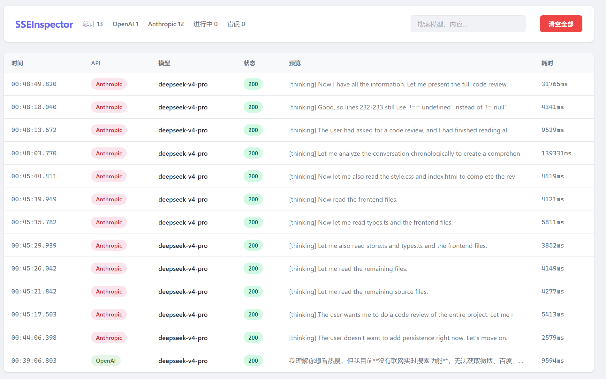
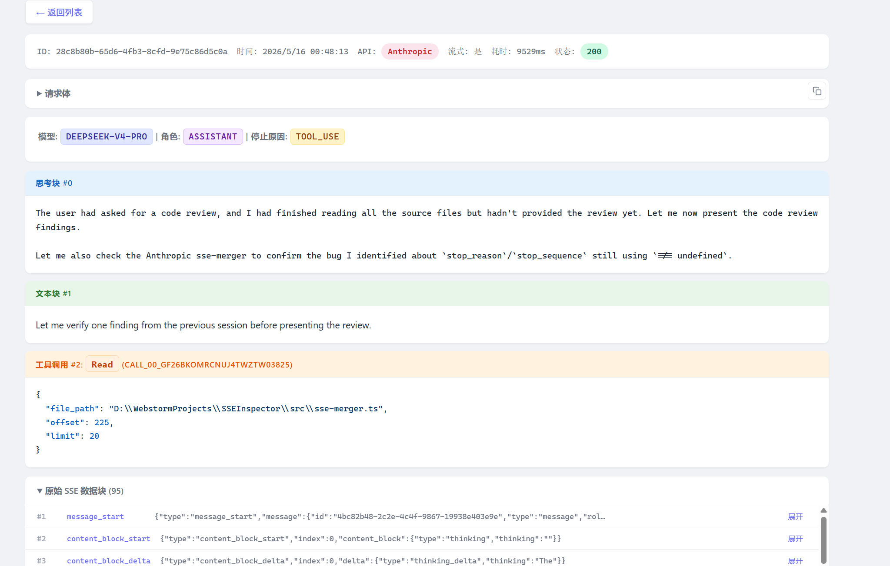

# SSEInspector

OpenAI / Anthropic API 代理检查器，实时记录流式请求和响应，无损转发 SSE 数据。

> 本项目全部代码由 AI（Claude Code）生成。

## 功能

- 代理 OpenAI (`/v1/chat/completions`、`/v1/responses`) 和 Anthropic (`/v1/messages`) 接口
- SSE 流式 delta 自动合并为完整响应
- **Monaco Editor** 展示 JSON（VS Code 原生代码折叠，词级展开/收起）
- 推理过程、回答正文、思考块、工具调用可视化展示
- 文本内容统一使用 Monaco 展示，支持 `Ctrl+F` 搜索
- 请求地址 / 代理地址分别显示，各自带 curl 复制按钮
- 工具调用结果 hover 显示对应 tool_use 详情
- 原始/合并响应体双视图切换
- 实时更新（Server-Sent Events），动态刷新导航位置
- 搜索过滤（模型名、内容）
- 非监控请求自动直通上游（如 `/v1/models`）
- 控制台打印每次请求的原始路径与代理后上游地址

## 启动

```bash
git clone https://github.com/codexvn/SSEInspector.git
cd SSEInspector
npm install

UPSTREAM_URL=http://your-upstream:8000 npm start
```

- `UPSTREAM_URL` — 上游 API 地址，必填
- `PORT` — 代理端口，默认 `3000`

## 使用

1. 启动后浏览器打开 `http://localhost:3000`
2. 将你的 API 客户端地址指向 `http://localhost:3000`
3. 发送请求即可在页面上实时看到记录

### 示例

```bash
curl http://localhost:3000/v1/chat/completions \
  -H "Content-Type: application/json" \
  -H "Authorization: Bearer sk-xxx" \
  -d '{
    "model": "deepseek-chat",
    "messages": [{"role": "user", "content": "你好"}],
    "stream": true
  }'
```

## 请求流向

| 路径 | 处理方式 |
|------|---------|
| `POST /v1/chat/completions` | 代理 + 记录（OpenAI 格式） |
| `POST /v1/responses` | 代理 + 记录（OpenAI Responses 格式） |
| `POST /v1/messages` | 代理 + 记录（Anthropic 格式） |
| 其他路径 | 透明代理，不记录 |

请求头（`Authorization`、`x-api-key` 等）和响应头均原样透传，客户端感知不到代理存在。

## 技术栈

TypeScript + Express + Monaco Editor + 原生 JS SPA（无框架）

## 样例截图





## License

MIT
